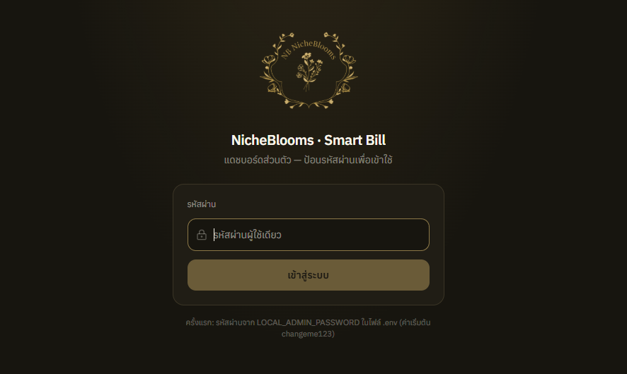

# NICHEBLOOMS Smart Bill Hub

ระบบเก็บเงินรายงวดแบบไทย ๆ — ไอดีพร้อมเพย์ QR สแกนจ่ายได้จริง บิลรวมรายคน เอาทุกรายการที่ถึงกำหนดมาออกใบเดียว ไม่เก็บเงินล่วงหน้า

NICHEBLOOMS Smart Bill Hub — Thai installment billing. PromptPay QR that scans for real. One receipt per customer with every due installment, no advance collection.

## ภาพหน้าจอ



## มันทำอะไร

- ใส่รายชื่อลูกค้า + งวดชำระ → ระบบออกใบเสร็จพร้อม QR PromptPay
- สแกน QR จ่ายผ่านแอปธนาคารไทยได้เลย (มาตรฐาน EMVCo จริง ๆ)
- บิลรวมรายคน: เจอลูกหนี้หลายงวด → กดปุ่มเดียวเอามารวมใบเดียว
- เก็บแค่งวดที่ถึงวันนี้แล้วเท่านั้น — อนาคตเก็บไม่ได้
- ค่าปรับรายวัน + ค่าติดตาม อัตราตั้งได้

## รันเครื่อง

ติดตั้ง Node 18+ กับ Git Bash (Windows)

```
git clone <repo-url>
cd NICHEBLOOMS_Smart_Bill_Hub
npm install
cp .env.example .env       # ตั้งรหัสผ่าน operator ในนี้
npm start
```

เปิด `http://localhost:3000` เข้าระบบด้วยรหัสผ่านใน `.env`

## ตั้งค่า

ตัวแปรใน `.env`:

| ตัวแปร | ความหมาย |
|---|---|
| `LOCAL_ADMIN_PASSWORD` | รหัสผ่านเข้าระบบ (ถ้าไม่ตั้ง ระบบจะ generate มาให้ครั้งแรกแล้วแสดงในเทอร์มินัล) |

## ความปลอดภัย

- ข้อมูลอยู่เครื่องเดียว ไม่มี cloud, ไม่มีเซิร์ฟเวอร์ภายนอก
- `.env` กับ `data/` ถูก gitignore ไว้แล้ว — อย่าอัพโหลดขึ้น git by accident
- รหัสผ่านเก็บแบบ scrypt hash + salt
- ถ้าไม่ตั้ง `LOCAL_ADMIN_PASSWORD` ระบบจะสร้างรหัสสุ่ม strong มาให้ครั้งแรก (ดูจาก terminal ตอน boot)

## โครงสร้าง

```
server/          # Express API
src/             # React frontend
data/            # JSON store (gitignored)
tests/           # unit test
```

## เทคโนโลยี

TypeScript, Express, React + Vite, JSON file store, QRCode.js

---

NICHEBLOOMS Smart Bill Hub v1.0.0 · Thai + English · 2026
